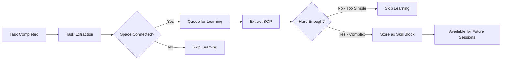

<div align="center">
  <br/>
  <br/>
  <a href="https://discord.gg/rpZs5TaSuV">
    <picture>
      <source media="(prefers-color-scheme: dark)" srcset="https://assets.memodb.io/Acontext/Acontext-oneway-dark.gif">
      
    </picture>
  <br/>
  <br/>
  </a>
  <p>
    <h3>Context Data Platform for Self-learning Agents</h3>
    <strong>Store Contexts ➡️ Observe Tasks ➡️ Learn Skills</strong>
  </p>
  <p align="center">
    <a href="https://pypi.org/project/acontext/"></a>
    <a href="https://www.npmjs.com/package/@acontext/acontext"></a>
    <a href="https://github.com/memodb-io/acontext/actions/workflows/core-test.yaml"></a>
    <a href="https://github.com/memodb-io/acontext/actions/workflows/api-test.yaml"></a>
    <a href="https://github.com/memodb-io/acontext/actions/workflows/cli-test.yaml"></a>
  </p>
  <p align="center">
    <a href="https://discord.gg/rpZs5TaSuV">
      
    </a>
  </p>
</div>


Acontext is a context data platform that:

- **Stores** contexts & artifacts
- **Observes** agent tasks and user feedback.
- Enables agent **self-learning** by collecting experiences (SOPs).  Context data → extract patterns → create & save skills → reuse & refine → agent improves. Acontext turns raw context into real, reusable experience.
- Offers a **local Dashboard** to view messages, tasks, artifacts and experiences.


<div align="center">
    <picture>
      
    </picture>
  <p>How Does Acontext Learn for Your Agents?</p>
</div>


We're building it because we believe Acontext can help you:

- **Build a more scalable agent product**
- **Improve your agent success rate and reduce running steps**

so that your agent can be more stable and provide greater value to your users.


# Core Concepts

- **Session** - A conversation thread that stores messages with multi-modal support. 
  - **Task** - extracted automatically from conversations. Tasks move through `pending` → `running` → `success`/`failed` states. 

- **Disk** - File storage for agent artifacts.

- **Space** - A knowledge repository (like Notion) for agent, where learned skills are stored. 
  - **Experience Agents** - Background AI agents that automatically extract tasks and learn skills. 
  - **Skill Block** - A learned SOP (Standard Operating Procedure) containing `use_when` conditions, user `preferences`, and `tool_sops` patterns. Only complex tasks become skills.

### How They Work Together

```bash
┌──────┐    ┌────────────┐    ┌─────────────────────────┐    ┌─────────────────────────┐
│ User │◄──►│ Your Agent │◄──►│ Session (stores msgs)   │    │ Disk (stores artifacts) │
└──────┘    └─────▲──────┘    └────────────┬────────────┘    └───────────▲─────────────┘
                  │                        │                              │
                  │                        │                    ┌─────────┴─────────┐
                  │                        │                    │ Agent reads/writes│
                  │                        │                    │ files as needed   │
                  │                        │                    └───────────────────┘
                  │                        ▼
                  │         ┌──────────────────────────────┐
                  │         │ Task Extraction              │
                  │         │ (by Experience Agent)        │
                  │         └──────────────┬───────────────┘
                  │                        │
                  │                        ▼
                  │         ┌──────────────────────────────┐
                  │         │ Task Completion              │
                  │         └──────────────┬───────────────┘
                  │                        │
                  │                        ▼
                  │         ┌──────────────────────────────┐
                  │         │ Space Connected?             │
                  │         └──────────────┬───────────────┘
                  │                        │ Yes
                  │                        ▼
                  │         ┌──────────────────────────────┐
                  │         │ Skill Learning               │
                  │         │ (by Experience Agent)        │
                  │         └──────────────┬───────────────┘
                  │                        │
                  │                        ▼
                  │         ┌──────────────────────────────┐
                  │         │ Skill Blocks (stored)        │
                  │         └──────────────┬───────────────┘
                  │                        │
                  │                        ▼
                  │         ┌──────────────────────────────┐
                  │         │ Search & Reuse in Future     │
                  │         └──────────────┬───────────────┘
                  │                        │
                  └────────────────────────┘
                     Skills guide agent behavior
```


# How to Start It? [📖](https://docs.acontext.io/local)

> 📖 means a document link

We have an `acontext-cli` to help you do quick proof-of-concept. Download it first in your terminal:

```bash
curl -fsSL https://install.acontext.io | sh
```

You should have [docker](https://www.docker.com/get-started/) installed and an OpenAI API Key to start an Acontext backend on your computer:

```bash
acontext docker up
```

> [📖](https://docs.acontext.io/settings/core) Acontext requires an LLM provider and an embedding provider. 
>
> We support OpenAI and Anthropic SDK formats and OpenAI and jina.ai embedding API formats

Once it's done, you can access the following endpoints:

- Acontext API Base URL: http://localhost:8029/api/v1
- Acontext Dashboard: http://localhost:3000/


<div align="center">
    <picture>
      
    </picture>
  <p>Dashboard of Success Rate and other Metrics</p>
</div>


# How to Use It?

We're maintaining Python [](https://pypi.org/project/acontext/) and Typescript []("https://www.npmjs.com/package/@acontext/acontext") SDKs. The snippets below are using Python.


## Install SDKs

```
pip install acontext # for Python
npm i @acontext/acontext # for Typescript
```


## Initialize Client

```python
from acontext import AcontextClient

client = AcontextClient(
    base_url="http://localhost:8029/api/v1"
    api_key="sk-ac-your-root-api-bearer-token"
)
client.ping()

# yes, the default api_key is sk-ac-your-root-api-bearer-token
```

> [📖 async client doc](https://docs.acontext.io/settings/core)


## Store

Acontext can manage agent sessions and artifacts.

### Save Messages [📖](https://docs.acontext.io/api-reference/session/send-message-to-session)

Acontext offers persistent storage for message data. When you call `session.send_message`, Acontext will persist the message and start to monitor this session:

```python
session = client.sessions.create()

messages = [
    {"role": "user", "content": "I need to write a landing page of iPhone 15 pro max"},
    {
        "role": "assistant",
        "content": "Sure, my plan is below:\n1. Search for the latest news about iPhone 15 pro max\n2. Init Next.js project for the landing page\n3. Deploy the landing page to the website",
    },
    {
        "role": "user",
        "content": "That sounds good. Let's first collect the message and report to me before any landing page coding.",
    },
    {
        "role": "assistant",
        "content": "Sure, I will first collect the message then report to you before any landing page coding.",
    },
]

# Save messages
for msg in messages:
    client.sessions.send_message(session_id=session.id, blob=msg, format="openai")
```

> [📖](https://docs.acontext.io/store/messages/multi-provider#anthropic-format) We support Anthropic SDK as well. 
>
> [📖](https://docs.acontext.io/store/messages/multi-modal) We support multi-modal message storage.

### Load Messages [📖](https://docs.acontext.io/api-reference/session/get-messages-from-session)

Obtain your session messages using `sessions.get_messages`

```python
r = client.sessions.get_messages(session.id)
new_msg = r.items

new_msg.append({"role": "user", "content": "How you doing?"})
r = openai_client.chat.completions.create(model="gpt-4.1", messages=new_msg)
print(r.choices[0].message.content)
client.sessions.send_message(session_id=session.id, blob=r.choices[0].message)
```

<div align="center">
    <picture>
      
    </picture>
  <p>You can view sessions in your local Dashboard</p>
</div>


### Artifacts [📖](https://docs.acontext.io/store/disk)

Create a disk for your agent to store and read artifacts using file paths:

<details>
<summary>Code Snippet</summary>

```python
from acontext import FileUpload

disk = client.disks.create()

file = FileUpload(
    filename="todo.md",
    content=b"# Sprint Plan\n\n## Goals\n- Complete user authentication\n- Fix critical bugs"
)
artifact = client.disks.artifacts.upsert(
    disk.id,
    file=file,
    file_path="/todo/"
)


print(client.disks.artifacts.list(
    disk.id,
    path="/todo/"
))

result = client.disks.artifacts.get(
    disk.id,
    file_path="/todo/",
    filename="todo.md",
    with_public_url=True,
    with_content=True
)
print(f"✓ File content: {result.content.raw}")
print(f"✓ Download URL: {result.public_url}")        
```
</details>


<div align="center">
    <picture>
      
    </picture>
  <p>You can view artifacts in your local Dashboard</p>
</div>


## Observe [📖](https://docs.acontext.io/observe)

For every session, Acontext will automatically launch a background agent to track the task progress and user feedback.

You can use the SDK to retrieve the current state of the agent session.

<details>
<summary>Full Script</summary>

```python
from acontext import AcontextClient

# Initialize client
client = AcontextClient(
    base_url="http://localhost:8029/api/v1", api_key="sk-ac-your-root-api-bearer-token"
)

# Create a project and session
session = client.sessions.create()

# Conversation messages
messages = [
    {"role": "user", "content": "I need to write a landing page of iPhone 15 pro max"},
    {
        "role": "assistant",
        "content": "Sure, my plan is below:\n1. Search for the latest news about iPhone 15 pro max\n2. Init Next.js project for the landing page\n3. Deploy the landing page to the website",
    },
    {
        "role": "user",
        "content": "That sounds good. Let's first collect the message and report to me before any landing page coding.",
    },
    {
        "role": "assistant",
        "content": "Sure, I will first collect the message then report to you before any landing page coding.",
      	"tool_calls": [
            {
                "id": "call_001",
                "type": "function",
                "function": {
                    "name": "search_news",
                    "arguments": "{\"query\": \"iPhone news\"}"
                }
            }
        ]
    },
]

# Send messages in a loop
for msg in messages:
    client.sessions.send_message(session_id=session.id, blob=msg, format="openai")

# Wait for task extraction to complete
client.sessions.flush(session.id)

# Display extracted tasks
tasks_response = client.sessions.get_tasks(session.id)
print(tasks_response)
for task in tasks_response.items:
    print(f"\nTask #{task.order}:")
    print(f"  ID: {task.id}")
    print(f"  Title: {task.data['task_description']}")
    print(f"  Status: {task.status}")

    # Show progress updates if available
    if "progresses" in task.data:
        print(f"  Progress updates: {len(task.data['progresses'])}")
        for progress in task.data["progresses"]:
            print(f"    - {progress}")

    # Show user preferences if available
    if "user_preferences" in task.data:
        print("  User preferences:")
        for pref in task.data["user_preferences"]:
            print(f"    - {pref}")

```
> `flush` is a blocking call, it will wait for the task extraction to complete.
> You don't need to call it in production, Acontext has a buffer mechanism to ensure the task extraction is completed right on time.

</details>

Script Example Return:

```txt
Task #1:
  ID: 60624fcf-7bd2-4ecc-84a3-5cfe8fa1810a
  Title: Search for the latest news about iPhone 15 Pro Max and report findings to the user before any landing page coding.
  Status: running
  Progress updates: 1
    - User clarified preference for reporting the collected news before starting coding, and I confirmed that the first step will be reporting before moving on to landing page development.
  User preferences:
    - user expects a report on latest news about iPhone 15 pro max before any coding work on the landing page.

Task #2:
  ID: 0036d009-257d-4acb-8244-b289cb48af09
  Title: Initialize a Next.js project for the iPhone 15 Pro Max landing page.
  Status: pending
  Progress updates: 0
  User preferences:

Task #3:
  ID: b75306ae-c95b-4f17-9818-223006e4ea7b
  Title: Deploy the completed landing page to the website.
  Status: pending
  Progress updates: 0
  User preferences:
```


You can view the session tasks' statuses in the Dashboard:

<div align="center">
    <picture>
      
    </picture>
  <p>A Task Demo</p>
</div>


## Self-learning

Acontext can gather a bunch of sessions and learn skills (SOPs) on how to call tools for certain tasks.

### Learn Skills to a `Space` [📖](https://docs.acontext.io/learn/skill-space)

A `Space` can store skills, experiences, and memories in a Notion-like system. You first need to connect a session to `Space` to enable the learning process:

```python
# Step 1: Create a Space for skill learning
space = client.spaces.create()
print(f"Created Space: {space.id}")

# Step 2: Create a session attached to the space
session = client.sessions.create(space_id=space.id)

# ... push the agent working context
```

The learning happens in the background and is not real-time (delay around 10-30s). 

What Acontext will do in the background:



Eventually, SOP blocks with tool-call pattern will be saved to `Space`. You can view every `Space` in the Dashboard:

<div align="center">
    <picture>
      
    </picture>
  <p>A Space Demo</p>
</div>


### Search Skills from a `Space` [📖](https://docs.acontext.io/learn/search-skills)

To search skills from a `Space` and use them in the next session:

```python
result = client.spaces.experience_search(
    space_id=space.id,
    query="I need to implement authentication",
  	mode="fast"
)
```

Acontext supports `fast` and `agentic` modes for search. The former uses embeddings to match skills. The latter uses a Notion Agent to explore the entire `Space` and tries to cover every skill needed.

The return is a list of sop blocks, which look like below:

```json
{
    "use_when": "star a github repo",
    "preferences": "use personal account. star but not fork",
    "tool_sops": [
        {"tool_name": "goto", "action": "goto the user given github repo url"},
        {"tool_name": "click", "action": "find login button if any, and start to login first"},
        ...
    ]
}
```


# Document

To understand what Acontext can do better, please view [our docs](https://docs.acontext.io/)


# Stay Updated

Star Acontext on Github to support and receive instant notifications ❤️


# Stay Together

Join the community for support and discussions:

-   [Discuss with Builders on Acontext Discord](https://discord.gg/rpZs5TaSuV) 👻 
-  [Follow Acontext on X](https://x.com/acontext_io) 𝕏 


# LICENSE
This project is currently licensed under [Apache License 2.0](LICENSE).